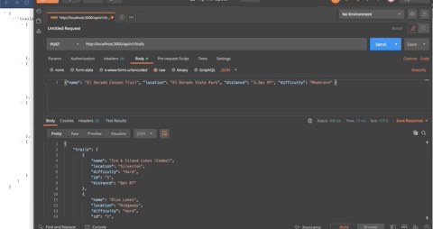

## Express Homework

[Leigh Larson](https://github.com/leighlars)  
[Homework spec](https://gist.github.com/cbdallavalle/83287a763b8c178d4dfd5d9ea03d981c)  
[Express Lesson Plan](https://frontend.turing.io/lessons/module-3/express.html)  

### Abstract
This project serves to showcase my ability to create an Express server with data. 
When serving as server, the user can get and post information about hiking trails. 
I utilized Postman to double check my methods.

### Tech / Systems Used
- Express
- Node.js
- Nodemon
- git Version Control

### Gif Showcase
 
*Viewing hard-coded data on server rendered on page*

 
*Viewing data added on Postman and rendered on page*

